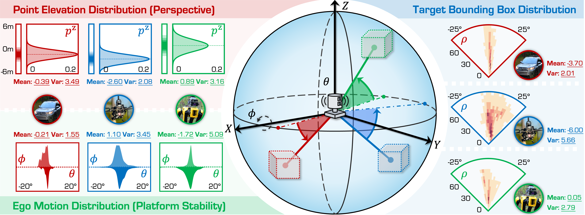
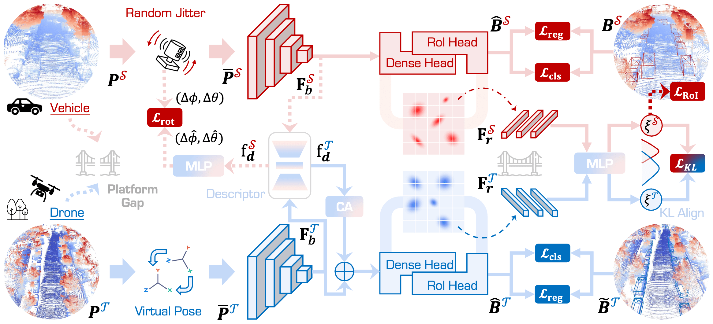

# Perspective-Invariant 3D Object Detection

  <a href="https://alanliang.vercel.app/" target="_blank">Ao Liang</a>*,1,2,3,4&nbsp;
  <a href="https://ldkong.com/" target="_blank">Lingdong Kong</a>*,1&nbsp;
  <a href="https://dylanorange.github.io/" target="_blank">Dongyue Lu</a>*,1&nbsp;
  <a href="" target="_blank">Youquan Liu</a>5&nbsp;
  <a href="" target="_blank">Jian Fang</a>4&nbsp;
  <a href="" target="_blank">Huaici Zhao</a>4&nbsp;
  <a href="https://www.comp.nus.edu.sg/~ooiwt/" target="_blank">Wei Tsang Ooi</a>1
   
  1National University of Singapore&nbsp;&nbsp;&nbsp;
  2University of Chinese Academy of Sciences&nbsp;&nbsp;&nbsp;
   
  3Key Laboratory of Opto-Electronic Information Processing, Chinese Academy of Sciences&nbsp;&nbsp;&nbsp;
   
  4Shenyang Institute of Automation, Chinese Academy of Sciences
  5Fudan University
   
  *Equally contributed to this work&nbsp;&nbsp;&nbsp;

  

  

  

With the rise of robotics, LiDAR‑based 3D object detection has garnered significant attention in both academia and industry. However, existing datasets and methods predominantly focus on vehicle‑mounted platforms, leaving other autonomous platforms underexplored. To bridge this gap, we introduce **Pi3DET**, the first benchmark featuring LiDAR data and 3D bounding‑box annotations collected from multiple platforms: vehicle, quadruped, and drone. This facilitates research in 3D object detection for non‑vehicle platforms as well as cross‑platform 3D detection. Based on Pi3DET, we propose a novel cross‑platform adaptation framework that transfers knowledge from the well‑studied vehicle platform to other platforms. This framework achieves perspective‑invariant 3D detection through robust alignment at both geometric and feature levels. Additionally, we establish a benchmark to evaluate the resilience and robustness of current 3D detectors in cross‑platform scenarios, providing valuable insights for developing adaptive 3D perception systems. Extensive experiments validate the effectiveness of our approach on challenging cross‑platform tasks, demonstrating substantial gains over existing adaptation methods.
We hope this work paves the way for generalizable and unified 3D perception systems across diverse and complex environments. Our Pi3DET dataset, cross‑platform benchmark suite, and annotation toolkit have been made publicly available.

# Overview
### Analyse

We observe significant cross-platform geometric discrepancies in ego‑motion jitter, point‑cloud elevation distributions, and target pitch‑angle distributions across vehicle, quadruped, and drone platforms, which hinder single‑platform model generalization.
 
 
 

### Method

Pi3DET‑Net employs a two‑stage adaptation pipeline—Pre‑Adaptation uses random jitter and virtual poses to learn and align global geometric transformations, while Knowledge Adaptation leverages geometry‑aware descriptors and KL‑based probabilistic feature alignment to synchronize feature distributions across platforms.  

## Updates
- **[July 2025]**: Project page released.
- **[June 2025]**: **Pi3DET** has been extended to <strong>Track 5: Cross-Platform 3D Object Detection</strong> of the <a href="https://robosense2025.github.io/" target="_blank" rel="noopener noreferrer"><strong><u>RoboSense Challenge</u></strong></a> at <a href="https://www.iros25.org/" target="_blank" rel="noopener noreferrer"><strong><u>IROS 2025</u></strong></a>. See the <a href="https://robosense2025.github.io/track5" target="_blank" rel="noopener noreferrer"><strong><u>track homepage</u></strong></a>, <a href="https://github.com/robosense2025/track5" target="_blank" rel="noopener noreferrer"><strong><u>GitHub repo</u></strong></a> for more details.

## Todo
> Since the Pi3DET dataset is being used for **Track 5: Cross-Platform 3D Object Detection** of the [**_RoboSense Challenge_**](https://robosense2025.github.io/) at [**_IROS 2025_**](https://www.iros25.org/), in the interest of fairness we are temporarily not releasing all of the data and annotations. If you’re interested, we have open‑sourced a subset of the data and code—please refer to the track details for more information.

- [ ] Release dataset.
- [ ] Release code.

## Pi3DET Dataset
### Detailed statistic information
| Platform                    | Condition      | Sequence               | # of Frames | # of Points (M) | # of Vehicles | # of Pedestrians |
|-----------------------------|----------------|------------------------|------------:|----------------:|--------------:|-----------------:|
| **Vehicle (8)**             | **Daytime (4)**| city_hall              |      2,982  |           26.61 |       19,489  |          12,199 |
|                             |                | penno_big_loop         |      3,151  |           33.29 |       17,240  |           1,886 |
|                             |                | rittenhouse            |      3,899  |           49.36 |       11,056  |          12,003 |
|                             |                | ucity_small_loop       |      6,746  |           67.49 |       34,049  |          34,346 |
|                             | **Nighttime (4)**| city_hall            |      2,856  |           26.16 |       12,655  |           5,492 |
|                             |                | penno_big_loop         |      3,291  |           38.04 |        8,068  |             106 |
|                             |                | rittenhouse            |      4,135  |           52.68 |       11,103  |          14,315 |
|                             |                | ucity_small_loop       |      5,133  |           53.32 |       18,251  |           8,639 |
|                             |                | **Summary (Vehicle)**  |     32,193  |          346.95 |      131,911  |          88,986 |
| **Drone (7)**               | **Daytime (4)**| penno_parking_1        |      1,125  |            8.69 |        6,075  |             115 |
|                             |                | penno_parking_2        |      1,086  |            8.55 |        5,896  |             340 |
|                             |                | penno_plaza            |        678  |            5.60 |          721  |              65 |
|                             |                | penno_trees            |      1,319  |           11.58 |          657  |             160 |
|                             | **Nighttime (3)**| high_beams           |        674  |            5.51 |          578  |             211 |
|                             |                | penno_parking_1        |      1,030  |            9.42 |          524  |             151 |
|                             |                | penno_parking_2        |      1,140  |           10.12 |           83   |             230 |
|                             |                | **Summary (Drone)**    |      7,052  |           59.47 |       14,534  |           1,272 |
| **Quadruped (10)**          | **Daytime (8)**| art_plaza_loop         |      1,446  |           14.90 |            0   |           3,579 |
|                             |                | penno_short_loop       |      1,176  |           14.68 |        3,532  |              89 |
|                             |                | rocky_steps            |      1,535  |           14.42 |            0   |           5,739 |
|                             |                | skatepark_1            |        661  |           12.21 |            0   |             893 |
|                             |                | skatepark_2            |        921  |            8.47 |            0   |             916 |
|                             |                | srt_green_loop         |        639  |            9.23 |        1,349  |             285 |
|                             |                | srt_under_bridge_1     |      2,033  |           28.95 |            0   |           1,432 |
|                             |                | srt_under_bridge_2     |      1,813  |           25.85 |            0   |           1,463 |
|                             | **Nighttime (2)**| penno_plaza_lights   |        755  |           11.25 |          197  |              52 |
|                             |                | penno_short_loop       |      1,321  |           16.79 |          904  |             103 |
|                             |                | **Summary (Quadruped)**|     12,300  |          156.75 |        5,982  |          14,551 |
| **All Three Platforms (25)**|                | **Summary (All)**      |     51,545  |          563.17 |      152,427  |         104,809 |

### Examples

