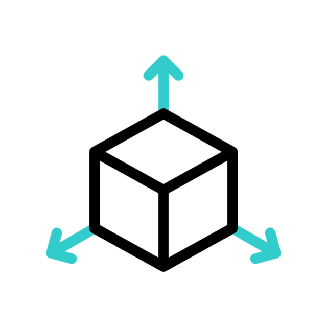
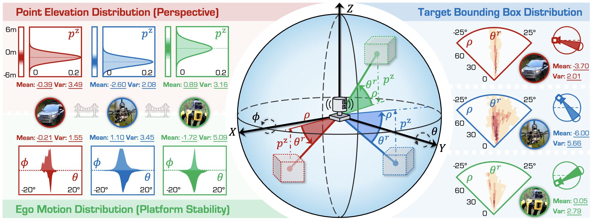

<p align="right">English | <a href="./README_CN.md">简体中文</a></p>  


<p align="center">
  

  <h1 align="center">
    <strong>Perspective-Invariant 3D Object Detection</strong>
  </h1>

  <p align="center">
    <a href="https://alanliang.vercel.app/" target="_blank">Ao Liang</a>&nbsp;&nbsp;&nbsp;&nbsp;
    <a href="https://ldkong.com/" target="_blank">Lingdong Kong</a>&nbsp;&nbsp;&nbsp;&nbsp;
    <a href="https://dylanorange.github.io/" target="_blank">Dongyue Lu</a>&nbsp;&nbsp;&nbsp;&nbsp;
    <a href="" target="_blank">Youquan Liu</a>&nbsp;&nbsp;&nbsp;&nbsp;
    <a href="" target="_blank">Jian Fang</a><br>
    <a href="" target="_blank">Huaici Zhao</a>&nbsp;&nbsp;&nbsp;&nbsp;
    <a href="https://www.comp.nus.edu.sg/~ooiwt/" target="_blank">Wei Tsang Ooi</a>
  </p>

  <p align="center">
    <a href="" target='_blank'>
      
    </a>&nbsp;
    <a href="http://pi3det.github.io/" target='_blank'>
      
    </a>&nbsp;
    <a href="" target='_blank'>
      
    </a>
  </p>

|  |
| :-: |

With the rise of robotics, LiDAR‑based 3D object detection has garnered significant attention in both academia and industry. However, existing datasets and methods predominantly focus on vehicle‑mounted platforms, leaving other autonomous platforms underexplored. To bridge this gap, we introduce **Pi3DET**, the first benchmark featuring LiDAR data and 3D bounding‑box annotations collected from multiple platforms: vehicle, quadruped, and drone. This facilitates research in 3D object detection for non‑vehicle platforms as well as cross‑platform 3D detection. Based on Pi3DET, we propose a novel cross‑platform adaptation framework that transfers knowledge from the well‑studied vehicle platform to other platforms. This framework achieves perspective‑invariant 3D detection through robust alignment at both geometric and feature levels. Additionally, we establish a benchmark to evaluate the resilience and robustness of current 3D detectors in cross‑platform scenarios, providing valuable insights for developing adaptive 3D perception systems. Extensive experiments validate the effectiveness of our approach on challenging cross‑platform tasks, demonstrating substantial gains over existing adaptation methods.
We hope this work paves the way for generalizable and unified 3D perception systems across diverse and complex environments. Our Pi3DET dataset, cross‑platform benchmark suite, and annotation toolkit have been made publicly available.

## Updates
- **[07/2025]** - The **Pi3DET** dataset has been extended to <strong>Track 5: Cross-Platform 3D Object Detection</strong> of the <a href="https://robosense2025.github.io/" target="_blank" rel="noopener noreferrer"><strong><u>RoboSense Challenge</u></strong></a> at <a href="https://www.iros25.org/" target="_blank" rel="noopener noreferrer"><strong><u>IROS 2025</u></strong></a>. See the <a href="https://robosense2025.github.io/track5" target="_blank" rel="noopener noreferrer">track homepage</a>, <a href="https://github.com/robosense2025/track5" target="_blank" rel="noopener noreferrer">GitHub repo</a> for more details.
- **[07/2025]** - The [project page]() is online. :rocket:
- **[07/2025]** - This work has been accepted to [ICCV 2025](https://iccv.thecvf.com/Conferences/2025). See you in Honolulu! :tada:


## Outline

- [Installation](#gear-installation)
- [Data Preparation](#hotsprings-data-preparation)
- [Getting Started](#rocket-getting-started)
- [Model Zoo](#snake-model-zoo)
- [Pi3DET Benchmark](#triangular_ruler-pi3det-benchmark)
- [TODO List](#memo-todo-list)
- [Citation](#citation)
- [License](#license)
- [Acknowledgements](#acknowledgements)


## :gear: Installation
For details related to installation and environment setups, kindly refer to [INSTALL.md](docs/INSTALL.md).


## :hotsprings: Data Preparation
Kindly refer to [this](https://huggingface.co/datasets/Pi3DET/data) HuggingFace Dataset page for more details.


## :rocket: Getting Started
To learn more usage of this codebase, kindly refer to [GET_STARTED.md](docs/GET_STARTED.md).


## :snake: Model Zoo
To be updated.


## :triangular_ruler: Pi3DET Benchmark
### Statistical Analysis

| |
| :-: |

We observe significant cross-platform geometric discrepancies in ego‑motion jitter, point‑cloud elevation distributions, and target pitch‑angle distributions across vehicle, quadruped, and drone platforms, which hinder single‑platform model generalization.


### Methodology

|  |
| :-: |

Pi3DET‑Net employs a two‑stage adaptation pipeline—Pre‑Adaptation uses random jitter and virtual poses to learn and align global geometric transformations, while Knowledge Adaptation leverages geometry‑aware descriptors and KL‑based probabilistic feature alignment to synchronize feature distributions across platforms.  


## Pi3DET Dataset
### Detailed statistical information
| Platform                    | Condition      | Sequence               | # of Frames | # of Points (M) | # of Vehicles | # of Pedestrians |
|-----------------------------|----------------|------------------------|------------:|----------------:|--------------:|-----------------:|
| **Vehicle (8)**             | **Daytime (4)**| city_hall              |      2,982  |           26.61 |       19,489  |          12,199 |
|                             |                | penno_big_loop         |      3,151  |           33.29 |       17,240  |           1,886 |
|                             |                | rittenhouse            |      3,899  |           49.36 |       11,056  |          12,003 |
|                             |                | ucity_small_loop       |      6,746  |           67.49 |       34,049  |          34,346 |
|                             | **Nighttime (4)**| city_hall            |      2,856  |           26.16 |       12,655  |           5,492 |
|                             |                | penno_big_loop         |      3,291  |           38.04 |        8,068  |             106 |
|                             |                | rittenhouse            |      4,135  |           52.68 |       11,103  |          14,315 |
|                             |                | ucity_small_loop       |      5,133  |           53.32 |       18,251  |           8,639 |
|                             |                | **Summary (Vehicle)**  |     32,193  |          346.95 |      131,911  |          88,986 |
| **Drone (7)**               | **Daytime (4)**| penno_parking_1        |      1,125  |            8.69 |        6,075  |             115 |
|                             |                | penno_parking_2        |      1,086  |            8.55 |        5,896  |             340 |
|                             |                | penno_plaza            |        678  |            5.60 |          721  |              65 |
|                             |                | penno_trees            |      1,319  |           11.58 |          657  |             160 |
|                             | **Nighttime (3)**| high_beams           |        674  |            5.51 |          578  |             211 |
|                             |                | penno_parking_1        |      1,030  |            9.42 |          524  |             151 |
|                             |                | penno_parking_2        |      1,140  |           10.12 |           83   |             230 |
|                             |                | **Summary (Drone)**    |      7,052  |           59.47 |       14,534  |           1,272 |
| **Quadruped (10)**          | **Daytime (8)**| art_plaza_loop         |      1,446  |           14.90 |            0   |           3,579 |
|                             |                | penno_short_loop       |      1,176  |           14.68 |        3,532  |              89 |
|                             |                | rocky_steps            |      1,535  |           14.42 |            0   |           5,739 |
|                             |                | skatepark_1            |        661  |           12.21 |            0   |             893 |
|                             |                | skatepark_2            |        921  |            8.47 |            0   |             916 |
|                             |                | srt_green_loop         |        639  |            9.23 |        1,349  |             285 |
|                             |                | srt_under_bridge_1     |      2,033  |           28.95 |            0   |           1,432 |
|                             |                | srt_under_bridge_2     |      1,813  |           25.85 |            0   |           1,463 |
|                             | **Nighttime (2)**| penno_plaza_lights   |        755  |           11.25 |          197  |              52 |
|                             |                | penno_short_loop       |      1,321  |           16.79 |          904  |             103 |
|                             |                | **Summary (Quadruped)**|     12,300  |          156.75 |        5,982  |          14,551 |
| **All Three Platforms (25)**|                | **Summary (All)**      |     51,545  |          563.17 |      152,427  |         104,809 |


### Dataset Examples


## :memo: TODO List
- [x] Initial release. 🚀
- [x] Release the dataset for the RoboSense Challenge 2025.
- [x] Release the code for the RoboSense Challenge 2025.
- [ ] Release the whole Pi3DET dataset.
- [ ] Release the code for the Pi3DET-Net method.


## Citation
If you find this work helpful for your research, please kindly consider citing our papers:

```bibtex
@inproceedings{liang2025pi3det,
    title     = {Perspective-Invariant 3D Object Detection},
    author    = {Ao Liang and Lingdong Kong and Dongyue Lu and Youquan Liu and Jian Fang and Huaici Zhao and Wei Tsang Ooi},
    booktitle = {Proceedings of the IEEE/CVF International Conference on Computer Vision},
    year      = {2025},
}
```


## License
This work is under the <a rel="license" href="https://www.apache.org/licenses/LICENSE-2.0">Apache License Version 2.0</a>, while some specific implementations in this codebase might be with other licenses. Kindly refer to [LICENSE.md](docs/LICENSE.md) for a more careful check, if you are using our code for commercial matters.


## Acknowledgements
This work is developed based on the [MMDetection3D](https://github.com/open-mmlab/mmdetection3d) codebase.

> <br>
> MMDetection3D is an open-source toolbox based on PyTorch, towards the next-generation platform for general 3D perception. It is a part of the OpenMMLab project developed by MMLab.

Part of the benchmarked models are from the [OpenPCDet](https://github.com/open-mmlab/OpenPCDet) and [3DTrans](https://github.com/PJLab-ADG/3DTrans) projects.
